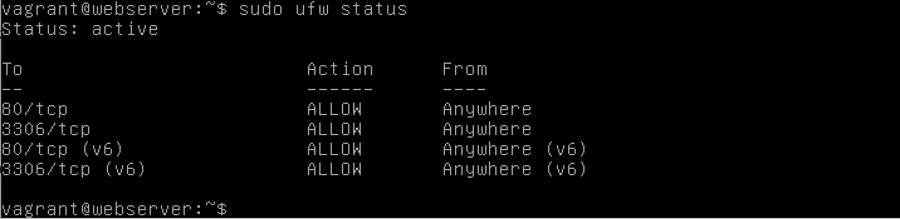

# Dokumentation

## _27_02_18_  
Git habe ich auch mittels der Seite installiert
danach have ich das Repository devops hinzugefügt.
Virtualbox habe ich vorinstalliert.
danach habe ich die Tests in der Anleitung gettestet und alles hat funktioniert
Ich habe Vargrant von der Seite installiert und getestet.
ich konnte eine Linux-VM erstellen sowie den Apache server, mittel Vagrant
Nach der Vagrant installation habe ich mein Terminal so eingestellt das er mir alle Befehle Logged.
und eine Script geschrieben welches mir meine Daten auf github hochladet.
für alle Commands Siehe Log_27_02_18.txt

## _06.03.18_  
Aktuell mache ich eine Liste mit Markdown shortcuts da dies von Vorteil ist und dabei lerne ich selber noch ein wenig die Markdown Shortcuts.
Zusätzlich habe ich noch eine Liste mit Linuxbefehlen erstellt und deis bereits in Markdown dokumentiert
mit einem Vagrantfile einen Apache Server einrichten
Siehe vagrantfile für configs  
Pfade angeben im Vagrantfile nicht nötig, dann wird VM einfach dort kreiert wo sich das Vagrantfile befindet

### Docker
da ich Vagrant angeshaut habe und mittels vagrant auch eine VM erstellen konnte.
Möchte mich noch mit Docker ausseinandersetzten
Docker installieren
Dockerfile erstellen
siehe Dockerfile `Docker\Dockerfile`
aber jedoch funktioniert es noch nicht siehe `log_07_03_18`, `07_03_18_v2`, `07_03_18_v3`, `07_03_18_v4`

## _13.03.18_
Jetzt funktioniert das Dockerfile das Problem war, ich dachte es funktioniere nicht.
Ich habe jetzt mittels docker ein Apache2 eingerichtet.
Siehe Docker Build wie ich das Docker Image erstelle und den Container starte.
Siehe log_13_03_18

aktuell versuche ich ein Dockerimage zu kreeieren mit einem Apache2 webserver welches mit einer Mysql Datenbank verbunden ist.
Das Dockerfile funktioniert der Apache Server läuft , jedoch funktioniert Mysql noch nicht. für Dockerfile siehe Apache_mysql/Dockerfile

## _20.03.18_
Aktuell versuche ich mein Vagrantfile so zu konfigurieren das ich mittels port forwarding zugreiffen kann.
es hat funktioniert nur griff ich von der falschen IP-adresse auf meinem Apache server zu.
### Firewall
Ich habe jetzt mein Vagrantfile erweiter mit einer Firewall und einem Reverproxy.
was ich neu implementiert habe ist das ich jetzt mittels provisioning die Shell Befehle in ein externes shell File habe, welches dann vom VM vagrantfile genutzt wird. um den Apache server sowie die Firewall zu insatllieren.
Das Problem das ich hatte war das mein Vagrantfile die Firewall nicht aktiviert hat.
dies habe ich gelöst indem ich `-f` bei `sudo ufw enable` eingefügt habe --> `sudo ufw -f enable`

## _27.03.18_
Ich habe mein Vagrantfile noch so angepasst, dass bei meine SQL-Datenbank noch ein Passwort gesetzt wird
siehe Log_27_03_18 sowie Vagrantfile 

## _03.04.18_  

Nun Beginne ich mit der LB2 dabei hat Docker eine zentrale Rolle
Neu habe ich jetzt noch die default html seite meines Apache servers ersetzt indem ich folgendes im Vagrant File konfiguriert habe
`config.vm.synced_folder "/Users/jasonnguy/reveal.js/","/var/www/html"`
 Zuerst kommt der Zielpfad danach der Pfad auf der VM.
 
## Test
alle Konfigurationen des Vagrantfiles können unter Potatoe/Vagrant config/ Vagrantfile und Vagrant.provision.sh eingsehen werden

### Apache Webserver

Man kann den Apache Server testen ob er Aktiv ist indem man entweder im Browser
`curl localhost:8080`
dann gibt es das html file aus des Webservers
Oder man geht vom Browser und gibt `localhost:8080` ein dann sollte folgendes angezeigt werden.

### Mysql

Man kann den Mysql Server testen indem man auf der VM
folgendes eingibt `mysqladmin -u root -p status`
dann wird man aufgefordert das Password für den Mysql Server einzugeben
danach wird folgendes angezeigt:

### Firewall
Die Firewall ist mit dem Befehl  `sudo ufw status` abrufbar smoit sind die Firewall Regeln ersichtlich und ob die Firewall aktiv ist.

## _10.04.18_  

### Docker
Nun beginne ich mit der LB2 bei der wir mit Docker arbeiten müssen.
ich habe vor einen Apache webserver einzubinden mit einer sql datenbank.
Docker compose wird genutz um mehrere Container  zu definierung und zu betreiben
Soeben habe ich einen Webserver kreeiert und das Default html mit einem eigenen ersetzt. siehe Dokerfile
Als nächstet installiere ich die Firewall und implementiere einen User und schaue mir das Monitoring an

## _17.04.18_  
Heute füge ich noch das Monitoring von meinem Dockerfile ein. Sowie die RAM Begrenzung. Bei jedem Dockerfile

## Test

### Firewall
Die Firewall ist mit dem Befehl  `sudo ufw status` abrufbar smoit sind die Firewall Regeln ersichtlich und ob die Firewall aktiv ist.

mit dem Befehl 
`docker stats` kann man den Container monitoren

### Cadvisor monitoring 
Monitoring vom Container mittels diesem Befehl
Zugriff auf Übersicht über localhost:8080 im Browser
`docker run -d --name cadvisor -v /:/rootfs:ro -v /var/run:/var/run:rw -v /sys:/sys:ro -v /var/lib/docker/:/var/lib/docker:ro -p 8080:8080 apache/cadvisor`

### Monitoring Container
Das Monitoring der anderen Container kann man hier sehen.
unter **Docker Containers** --> unter **Subcontainers** --> den jeweiligen Container auswählen.

## Sicherheit

### RAM Begrenzung
Die Maximale RAM kann mit folgendem Befehl festgelegt werden.
`docker run -m 2096m --memory-swap 2096m`

## Docker User
Ein Docker User erstellen mit folgendem Befehl
`RUN groupadd -r Docker_Group && useradd -r -g Docker_Group jasontester`

Mittels `docker run -ti Docker_NAME:Version /bin/bash` auf den Container verbinden und dann `SU jasontester` um sich mit dem User einzuloggen
